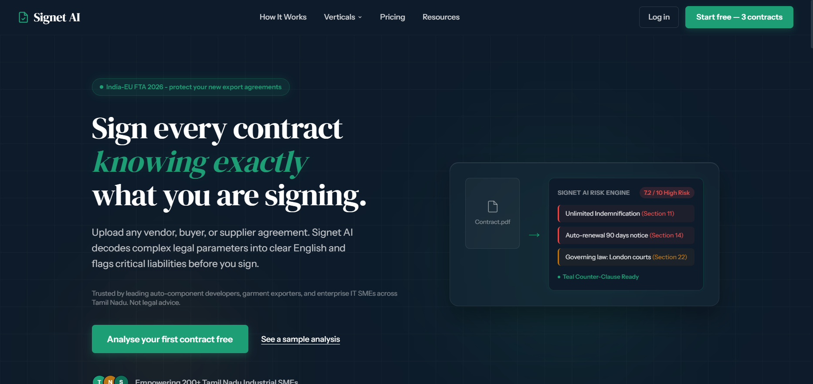
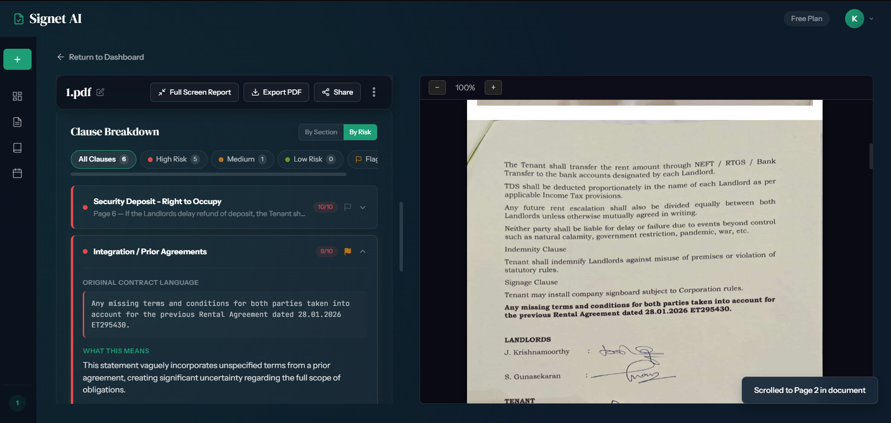

# Signet AI — AI Contract Risk Analyzer for Indian SMEs

Vercel Deployment: [Live Demo](https://signetai.vercel.app)
> [!WARNING]
> **DEVELOPMENT STATUS: UNDER ACTIVE DEVELOPMENT**  
> This project is currently in active development. Features, database schemas, and interfaces are subject to frequent updates and iterations before final production release.

Signet AI is a specialized, premium B2B contract risk intelligence engine designed for Indian SMEs, manufacturers, and exporters. Built to resolve the critical legal bottleneck faced by businesses in Tamil Nadu and beyond, Signet AI scans complex vendor, buyer, and service agreements to isolate costly legal pitfalls—such as auto-renewal traps, unilateral quality audit terminations, and unlimited liability parameters—in under 60 seconds.

---

## 📸 Interface Preview

Below are placeholder sections for key pages. Re-locate your screenshots to `docs/screenshots/` with the exact filenames to automatically populate the README preview:

### 1. High-Tech Public Landing Page
The dynamic landing interface featuring vibrant technical grid meshes, isometric glowing gradients, and glassmorphic micro-interactions.


### 2. Dual-Pane Contract Risk Inspector
The analytical workplace with circular risk gauges, interactive stats breakdown, and plain-English clause translations.


### 3. Camouflage Dashboard & Navigation Shell
The custom SaaS environment equipped with active slide-on-scroll navigation and a responsive hover-expand left sidebar.


---

## 🌟 Industry-Specific Verticals

Signet AI features tailored risk parameters for India's high-volume industrial hubs:
* 🚗 **Auto Component Suppliers (Hosur, Chennai, Coimbatore):** Identifies unilateral buyer quality audits, IP tooling/dies confiscation traps, and volume commitment imbalances in OEM agreements.
* 👕 **Garment Exporters (Tiruppur, Erode):** Detects auto-renewal traps, foreign jurisdiction clauses (EU/UK), and disproportionate delay shipment penalty clauses.
* 💻 **IT, SaaS & Electronics SMEs:** Checks work-for-hire IP transfer, data lock-ins, service level agreement (SLA) downtime penalties, and liability mismatch zones.

---

## 🛠️ Technology Stack

The platform is engineered using modern, robust web technologies:
* **Frontend Framework:** Next.js 14 (App Router)
* **Programming Language:** TypeScript
* **Styling & Theme:** Tailwind CSS & Vanilla CSS Design Tokens (Custom dark-navy `#0D1B2A` theme)
* **Database & ORM:** Supabase PostgreSQL with Drizzle ORM
* **Authentication:** Supabase Auth (with Google OAuth integration)
* **Icons:** Lucide React

---

## 🚀 Getting Started

### 1. Prerequisites
Ensure you have Node.js (v18+) and npm installed on your system.

### 2. Clone and Install
Clone the project repository and install its dependencies:
```bash
git clone https://github.com/Tab-To-LightSpeed24/SignetAI.git
npm install
```

### 3. Configure Environment Variables
Create a `.env.local` file in the root directory and configure your Supabase credentials:
```env
NEXT_PUBLIC_SUPABASE_URL=your_supabase_url
NEXT_PUBLIC_SUPABASE_ANON_KEY=your_supabase_anon_key
DATABASE_URL=your_postgresql_drizzle_connection_string
```

### 4. Run the Development Server
Boot up the local server to run on [http://localhost:3000](http://localhost:3000):
```bash
npm run dev
```

### 5. Type Safety Check
To verify that all files conform to strict type safety specifications, run:
```bash
npx tsc --noEmit
```
