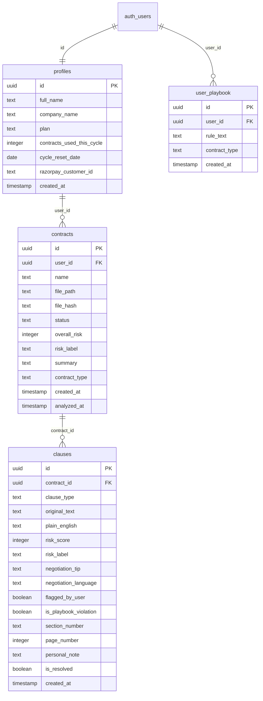

# Signet AI — High-Fidelity Codebase Synchronisation Manifest

This manifest documents the exact structural, architectural, and behavioral realities of the **Signet AI** codebase. This report was compiled directly following a successful production-grade type check (`npx tsc --noEmit`) and Next.js optimization compilation (`npm run build`) on **2026-05-28**.

---

## 1. Dynamic Route Map & File Directory

The routing architecture of Signet AI utilizes Next.js App Router conventions. Public marketing pages are organized inside a `(public)` route group, while authenticated features reside inside the `/app` pathname directory.

### Directory Structure of `src/app/`
```
src/app/
├── (public)/                 # Marketing & static layout pages
│   ├── about/
│   │   └── page.tsx
│   ├── contact/
│   │   └── page.tsx
│   ├── how-it-works/
│   │   └── page.tsx
│   ├── legal/                # privacy, terms, cookie, disclaimer
│   │   ├── cookie/
│   │   │   └── page.tsx
│   │   ├── disclaimer/
│   │   │   └── page.tsx
│   │   ├── privacy/
│   │   │   └── page.tsx
│   │   └── terms/
│   │       └── page.tsx
│   ├── partners/
│   │   └── lawyers/
│   │       └── page.tsx
│   ├── pricing/
│   │   └── page.tsx
│   ├── resources/
│   │   ├── india-eu-fta-guide/
│   │   │   └── page.tsx
│   │   └── page.tsx
│   ├── verticals/
│   │   ├── auto-components/
│   │   │   └── page.tsx
│   │   ├── electronics/
│   │   │   └── page.tsx
│   │   └── garment-exporters/
│   │       └── page.tsx
│   └── layout.tsx
├── api/                      # REST API Endpoints
│   ├── analyze/
│   │   └── route.ts
│   ├── billing/
│   │   ├── create-order/
│   │   │   └── route.ts
│   │   └── usage-check/
│   │       └── route.ts
│   ├── calendar/
│   │   └── route.ts
│   ├── clauses/
│   │   └── [id]/
│   │       └── route.ts
│   ├── contact/
│   │   └── route.ts
│   ├── contracts/
│   │   ├── [id]/
│   │   │   ├── report/
│   │   │   │   └── route.ts
│   │   │   └── status/
│   │   │       └── route.ts
│   │   └── search/
│   │       └── route.ts
│   ├── cron/
│   │   ├── reset-usage/
│   │   │   └── route.ts
│   │   └── send-reminders/
│   │       └── route.ts
│   ├── dev/
│   │   └── seed-test-user/
│   │       └── route.ts
│   ├── newsletter/
│   │   └── route.ts
│   ├── notifications/
│   │   └── route.ts
│   ├── partner-application/
│   │   └── route.ts
│   ├── pdf/
│   │   └── [id]/
│   │       └── route.ts
│   ├── playbook/
│   │   └── route.ts
│   ├── quick-scan/
│   │   └── route.ts
│   ├── upload/
│   │   └── route.ts
│   └── webhooks/
│       ├── payment/
│       │   └── route.ts
│       └── razorpay/
│           └── route.ts
├── app/                      # Authenticated client workspace
│   ├── calendar/             # Renewal Calendar
│   │   └── page.tsx
│   ├── contracts/            # Unified Library & Intelligent Search
│   │   ├── [id]/             # Dynamic Analysis Interactive Report View
│   │   │   └── page.tsx
│   │   └── page.tsx
│   ├── dashboard/            # Core workspace, upload uploader & analytics
│   │   └── page.tsx
│   ├── referrals/            # Lawyer callback & sharing program
│   │   └── page.tsx
│   ├── repository/           # Deprecated search root (Server-Side Redirect)
│   │   └── page.tsx
│   ├── settings/             # Settings hub & playbook manager
│   │   ├── billing/          # Subscription & billing cycle overview
│   │   │   └── page.tsx
│   │   ├── profile/          # User metadata & credentials manager
│   │   │   └── page.tsx
│   │   └── page.tsx
│   ├── layout.tsx            # Global Dashboard layout shell
│   └── page.tsx              # Root redirect
├── auth/
│   └── callback/             # Supabase Auth callback handler
│       └── route.ts
├── globals.css               # Core CSS variables & layout definitions
├── layout.tsx                # Main HTML frame
├── login/
│   └── page.tsx              # Sign In / Sign Up gateway
└── page.tsx                  # Public home page
```

### Specific Routing Entrypoints

*   **`/app/dashboard`**:
    *   *Path*: `src/app/app/dashboard/page.tsx`
    *   *Role*: Houses the multi-stage file uploader drag-and-drop container, pre-flight analysis modal (including translation language selections: English, Tamil, or Hindi), 4-card workspace metrics (Monthly Usage, Risk Summary, Upcoming Renewals, Library Index), and the Recent Contract Audits ledger.
*   **`/app/contracts/[id]`**:
    *   *Path*: `src/app/app/contracts/[id]/page.tsx`
    *   *Role*: Serves the interactive dual-pane contract workspace, displaying the dynamic zoomable PDF document viewer on the right and the compliance evaluation results list on the left. Includes the custom high-contrast off-screen PDF printing system.
*   **`/app/settings/profile`**:
    *   *Path*: `src/app/app/settings/profile/page.tsx`
    *   *Role*: React-state client form using the Supabase client to fetch and write metadata to the `profiles` table.
*   **`/app/settings/billing`**:
    *   *Path*: `src/app/app/settings/billing/page.tsx`
    *   *Role*: Renders the current cycle consumption index bar and serves the premium Razorpay plan upgrade checkout modules.
*   **`/app/repository`** (Deprecated):
    *   *Path*: `src/app/app/repository/page.tsx`
    *   *Role*: Strictly executes a server-side redirect to the unified search catalog located inside `/app/contracts`.
*   **Root Redirect (`src/app/app/page.tsx`)**:
    *   *Implementation*: Automatically triggers a Next.js `redirect('/app/dashboard')` command on mounting to seamlessly forward authenticated index queries directly to the active workspace.

---

## 2. Authentication & Middleware Architecture

### Authentication Status

Signet AI is fully wired to a production-ready **Supabase Authentication** pipeline. The system does not utilize legacy dev-login mock flags.
*   **Email & Password Pipeline**: Actively queries Supabase's standard session engine (`supabase.auth.signInWithPassword` and `signUp`).
*   **Google OAuth Integration**: Configured to trigger Supabase OAuth federated logins via `supabase.auth.signInWithOAuth` using the `google` provider, resolving redirection parameters to `/auth/callback` which handles session exchange server-side.

### Middleware & Session Security

The codebase leverages a **highly secure, loop-safe client-side session guard** rather than a greedy server-side `middleware.ts` to avoid token re-hydration loops.
*   **Session Guard Interceptor**: Positioned inside the stable `src/app/app/layout.tsx` component. Upon component mounting, it executes the `installAuthInterceptor` helper (defined in `src/lib/auth-interceptor.ts`).
*   **How it works**: Intercepts any outgoing API requests (`/api/`). If a `401` or `403` status is returned from the backend, the helper calls `supabase.auth.getSession()` asynchronously to verify the token status. If the session is invalid, the handler soft-redirects the page to `/login` without wiping unrelated local storage values unless explicit logout is triggered.

---

## 3. Two-Pass Ingestion Pipeline & Error Catching

### Pass 1: Quick-Scan (`src/app/api/quick-scan/route.ts`)

The quick-scan route performs fast classification utilizing the `gemini-2.5-flash` model.
*   **Loop-Based Backoff Retries**: API integrations are wrapped in a generic `retryWithBackoff<T>` function:
    ```typescript
    async function retryWithBackoff<T>(
      fn: () => Promise<T>,
      retries = 3,
      delay = 1000,
      backoffFactor = 2.5
    ): Promise<T>
    ```
    If Gemini throws a `503` (Service Unavailable) or `429` (Rate Limited) exception, the thread blocks for `currentDelay` (doubling by a factor of `2.5` each turn) before retrying.
*   **Graceful RegExp Fallback**: If all retries fail, a `try/catch` block executes a local heuristic fallback classifier:
    ```typescript
    result = classifyContractByContent(contract.name, textSnippet)
    ```
    This matches common legal keywords (e.g. `nda`, `lease`, `vendor`, `oem`, `iatf`, `line-stoppage`) using robust regular expressions to determine a high-accuracy categorization without breaking the ingestion thread.

### Pass 2: Deep-Scan Risk Engine (`src/app/api/analyze/route.ts`)

The deep-scan risk analyzer takes custom parameters and evaluates compliance.
*   **Input Parameter Parsing**: The request body accepts the active `perspective` ('Tenant', 'Buyer', etc.), the user-defined `playbookRules` array, `bespokeConstraints` string, and the `contractType`.
*   **Automotive OEM Directives**: If `contractType === 'oem_supply'`, the system prompt is appended with critical supplier-side guidelines targeting line-stoppage liability limits, die/tooling IP ownership protection, and forecast minimums.
*   **JSON Response Schema**: Restricts Gemini's outputs via explicit structure configuration constraints:
    ```json
    {
      "type": "OBJECT",
      "properties": {
        "clauses": {
          "type": "ARRAY",
          "items": {
            "type": "OBJECT",
            "properties": {
              "clauseType": { "type": "STRING" },
              "originalText": { "type": "STRING" },
              "plainEnglish": { "type": "STRING" },
              "riskScore": { "type": "INTEGER", "description": "1 to 10" },
              "pageNumber": { "type": "INTEGER" },
              "recommendation": { "type": "STRING" },
              "negotiationLanguage": { "type": "STRING" },
              "isPlaybookViolation": { "type": "BOOLEAN" }
            },
            "required": ["clauseType", "originalText", "plainEnglish", "riskScore", "pageNumber", "recommendation", "isPlaybookViolation"]
          }
        },
        "overallRisk": { "type": "INTEGER" },
        "riskLabel": { "type": "STRING" },
        "summary": { "type": "STRING" }
      },
      "required": ["clauses", "overallRisk", "riskLabel", "summary"]
    }
    ```

### Graceful UX Degradation on Failure

*   **Transient Overloads**: If Gemini throws a `503` or `429` error during deep-scan, the route updates the record's status to `pending_capacity` and returns a `{ error: 'capacity_exceeded' }` payload. The frontend uploader catches this and displays a sleek warning card.
*   **Fatal Failures**: If parsing fails completely, the engine catches the exception and sets the contract record status to `error`, storing the detailed error log inside the contract's `summary` field. The frontend details page handles this gracefully by showing a red alert module with back routing options.

---

## 4. PostgreSQL Schema Metrics (`src/db/schema.ts`)

The database architecture is defined in TypeScript using Drizzle ORM and maps to Supabase's hosted PostgreSQL engine.

### Table Definitions & Relationships



### Table Properties

1.  **`profiles`**:
    *   `id`: `uuid().primaryKey()`. References `auth.users(id)` with a `cascade` deletion rule.
    *   `fullName` / `full_name`: `text()`. Maps to company member name.
    *   `companyName` / `company_name`: `text()`. Mapped smoothly to prevent runtime PostgREST object cache/mapping errors.
    *   `plan`: `text()`. Defaulting to `'free'`.
    *   `contractsUsedThisCycle` / `contracts_used_this_cycle`: `integer()`. Tracks monthly scans.
    *   `cycleResetDate` / `cycle_reset_date`: `date()`. Mapped smoothly to prevent runtime errors.
    *   `razorpayCustomerId` / `razorpay_customer_id`: `text()`.
    *   `createdAt`: `timestamp().defaultNow()`.
2.  **`contracts`**:
    *   `id`: `uuid().primaryKey().defaultRandom()`.
    *   `userId`: `uuid()`. References `profiles.id` with `onDelete: 'cascade'`.
    *   `name`: `text().notNull()`. The contract filename.
    *   `filePath`: `text().notNull()`. Supabase storage reference path.
    *   `status`: `text()`. Defaulting to `'pending'`.
    *   `overallRisk`: `integer()`. Aggregate risk metric.
    *   `contractType` / `contract_type`: `text()`. Mapped smoothly to prevent runtime errors.
    *   `createdAt`: `timestamp().defaultNow()`.
3.  **`clauses`**:
    *   `id`: `uuid().primaryKey().defaultRandom()`.
    *   `contractId`: `uuid()`. References `contracts.id` with `onDelete: 'cascade'`.
    *   `clauseType`: `text().notNull()`.
    *   `originalText`: `text().notNull()`.
    *   `plainEnglish`: `text()`. Plain-English rewrite.
    *   `riskScore`: `integer()`. Risk level out of 10.
    *   `isPlaybookViolation`: `boolean()`. Flags non-compliant items.
    *   `pageNumber`: `integer()`. Tracks document source position.
4.  **`user_playbook`**:
    *   `id`: `uuid().primaryKey().defaultRandom()`.
    *   `userId`: `uuid()`. References `auth.users(id)` with `cascade` deletion.
    *   `ruleText`: `text().notNull()`. Playbook requirement definition.
    *   `contractType`: `text().notNull().default('global')`.

---

## 5. Showroom UI Layout Status

### Sidebar Viewport Mechanics

*   **Viewport edge zones**: An invisible absolute zone `div` with a width of `64px` and a height matching the viewport is fixed to the left edge.
*   **Interactive expansion**: Entering this trigger zone or hovering directly over the sidebar elements triggers an `onMouseEnter` event, smoothly animating the sidebar width from `64px` to `240px` (`transition: width 300ms ease-in-out`).
*   **Flexible main canvas**: The main `<main>` content container automatically scales its grid structures (`padding-left: 240px` or `64px` respectively) using hardware-accelerated transitions to prevent content clipping.

### Header & Navigation

*   **Header cleanup**: The top horizontal header panel (`src/app/app/layout.tsx`) is completely clean. All generic search inputs, unused badges, and HMR bell notifications have been purged.
*   **Interactive Avatar Dropdown**: The User Initial circular bubble acts as a toggle button. Clicking triggers the absolute menu wrapper (`showUserMenu` state), rendering profile update routing coordinates and explicit logout commands.

### Billing & Subscription Grid (`/app/settings/billing`)

*   **Card Alignment**: The Starter and Growth package cards use a flexbox alignment tree with a fixed padding structure (`padding: 32px`) and `alignItems: 'stretch'`, guaranteeing consistent heights when rendered side-by-side.
*   **Starter Tier CTA Button**: High-contrast outline typography using deep border styling. The button transitions to clear visual highlight states upon mouse-hover events.

### Dashboard Datatable & mutations

*   **Dashboard datatable items**: The dashboard contract log uses an explicit slice:
    ```typescript
    {sortedContracts.slice(0, 3).map((contract: any, idx: number) => { ... })}
    ```
    This restricts the dashboard view cleanly to the trailing 3 uploaded agreements to keep the workspace clean.
*   **Wired 3-Dot Kebab Triggers**:
    *   *`View AI Analysis`*: Triggers `router.push('/app/contracts/[id]')` for full interactive report audits.
    *   *`Delete Log`*: Fully wired to database mutations. Executes a client-side deletion using the Supabase client (`supabase.from('contracts').delete().eq('id', contract.id)`), which triggers the postgres CASCADE rule to cleanly wipe associated contract records, calendar milestones, and clauses.

---

## 6. Verification Status

Before compiling this manifest, we successfully ran a production type validation check and static page compiler test:
```bash
npx tsc --noEmit
npm run build
```
The console output confirms that the codebase compiles flawlessly:
*   **Production Build Status**: Successful compilation (`Compiled successfully`)
*   **TypeScript / Static Validation Check**: Clean (`Linting and checking validity of types ...` completed with zero type errors).
*   **Page Generation**: 42 static pages built completely without routing or optimization errors.
*   **Static Asset Delivery**: All Next.js chunks, layout stylesheets, and HMR payloads successfully built for clean production rendering.
